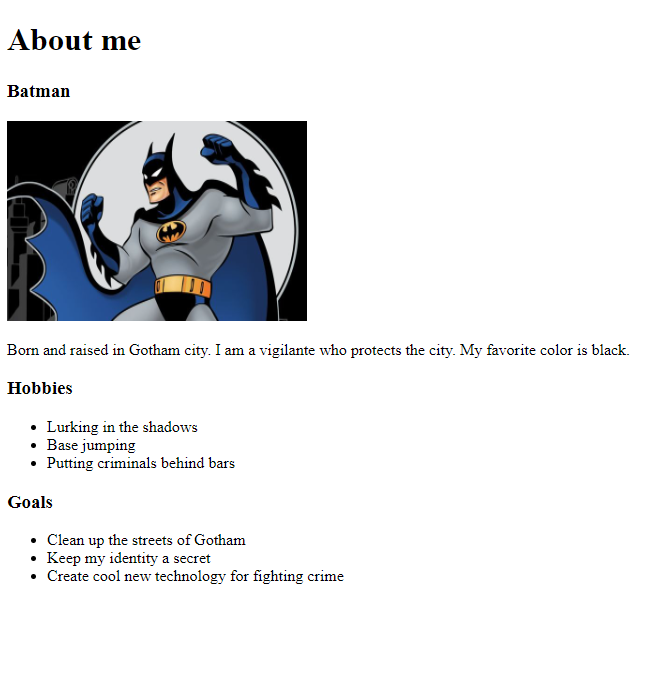

## About Me Website

Create an about me website to practice the different HTML tags

This website will not have any CSS, so it will look pretty plain

What should your website have?
- YOU MUST INCLUDE 10 different types of tags including the required ones (doctype, html, head, body)

- 3 different sections to your website
    - Bio with picture
    - list of hobbies 
    - list of goals for the future  

